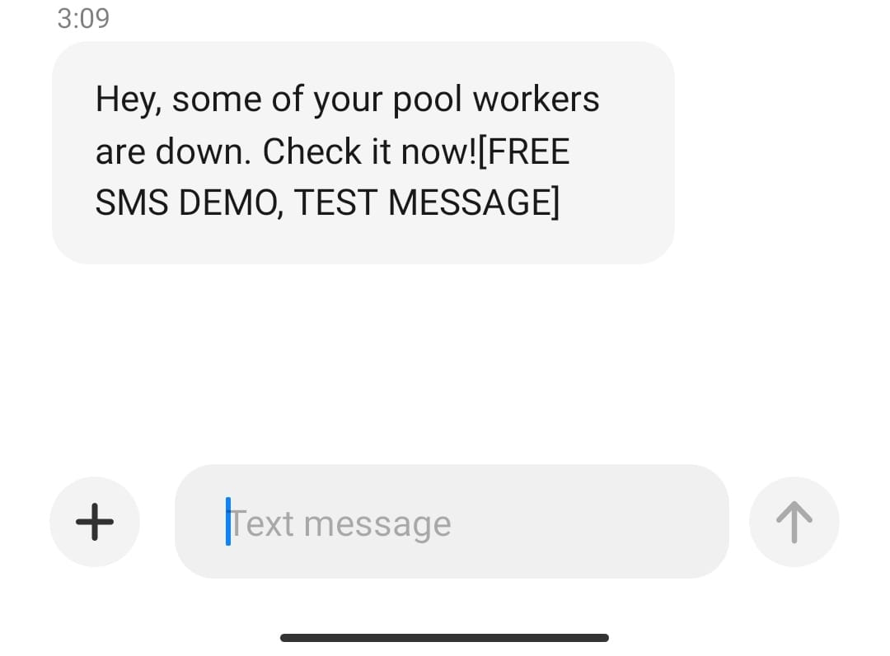

# Miner Checker :eyes: 
**Miner checker** is a service that will see each thirty minutes over the Ethermine mining pool and will notify you through an SMS if any of your workers are down.

### APIs used
* [Vonage to sent SMS](https://www.vonage.com.ar/)
* [Ethermine API to get the info of the workers](https://ethermine.org/api/)

### How to use it
To use it you must add a `.env` file in the root with the following info.
```
NEXMO_API_KEY=[YOUR_API_KEY]
NEXMO_API_SECRET=[YOUR_API_SECRET]
WALLET_ID=[THE_WALLET_ID_ASSOCIATED_TO_ETHERMINE]
CELLPHONE_NUMBER=[YOUR_PHONE_NUMBER]
```
Then you can run the service and when one of your workers went down you will receive a message like this
